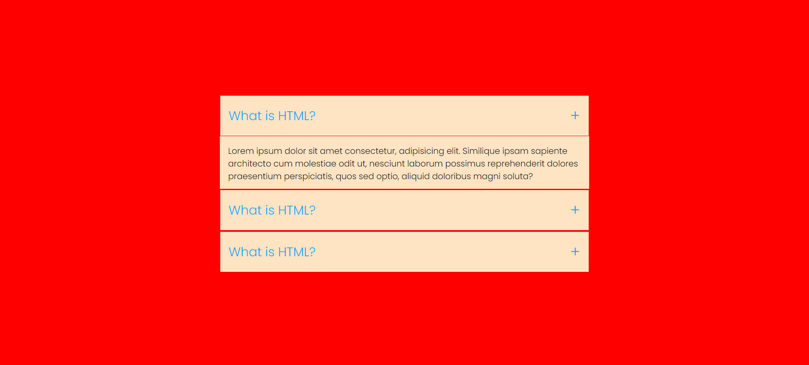

# Simple Accordion Project

This is a simple accordion project created with HTML and CSS. It allows you to toggle the display of content sections by clicking on labels.




## Table of Contents

- [Demo](#demo)
- [Features](#features)
- [Usage](#usage)


## Demo

You can see a live demo of this project [here](https://prismatic-shortbread-18a1f2.netlify.app/).

## Features

- Basic accordion functionality
- Easy to customize
- Minimal HTML and CSS

## Usage

1. Clone the repository to your local machine:

   ```bash
   git clone https://github.com/Rohith-Manjunath/Mini-projects2.git

2. Navigate to the project directory:

       cd Mini-projects2
       cd Accordian
      
   

3. Open the `index.html` file in your web browser to view the accordion in action.

## Customization

You can easily customize the accordion to suit your needs:

- Add or remove accordion sections by duplicating or deleting the provided HTML structure inside the `<ul>` element.

- Modify the content inside each section as needed.

- Adjust the styles in the `styles.css` file to change the appearance of the accordion, such as colors, fonts, and spacing.
