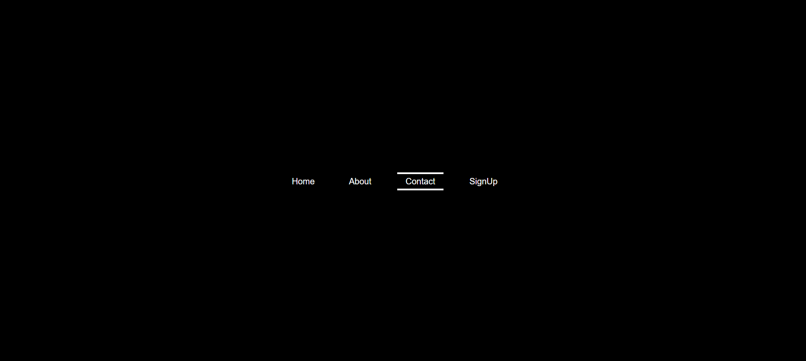

# Creative Navbar Project

This is a simple creative navbar project created using HTML, CSS, and JavaScript. It features a visually appealing navigation bar with interactive animations.




## Table of Contents

- [Demo](#demo)
- [Features](#features)
- [Getting Started](#getting-started)
- [Usage](#usage)


## Demo

You can see a live demo of this project [here](https://lighthearted-puppy-d6d9f1.netlify.app/).

## Features

- Responsive navigation bar design.
- Creative animations for menu items.
- Easy-to-customize codebase.
- Cross-browser compatibility.

## Getting Started

To get a copy of this project up and running on your local machine, follow these steps:

1. Clone this repository to your local machine using:

   ```bash
   git clone https://github.com/Rohith-Manjunath/Mini-projects2.git

## Usage

1. Open the `index.html` file in your web browser to view the navbar.

2. Explore the HTML, CSS, and JavaScript files to understand how the navbar is constructed and styled.

3. Customize the navbar according to your project's needs by modifying the HTML and CSS.
