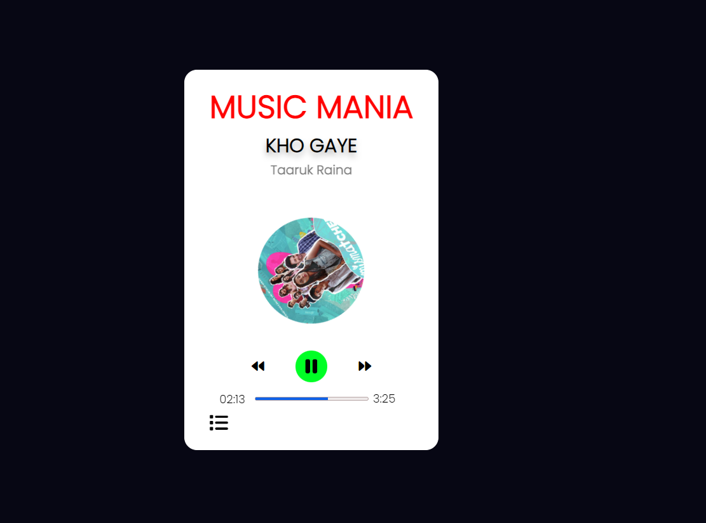

# Music Player Project 🎵

A responsive and feature-rich music player application built with HTML, CSS, and JavaScript. Enjoy seamless music playback, intuitive controls, and a modern user interface.

## Table of Contents

- [Features](#features)
- [Screenshots](#screenshots)
- [Installation](#installation)
- [Usage](#usage)
- [Live Demo](#live-demo)

## Features

- **Play, Pause, Next, Previous:** Control your music playback with easy-to-use buttons.
- **Keyboard Shortcuts:** Use keyboard shortcuts for quick control (spacebar for play/pause, right arrow for skip forward, left arrow for skip backward).
- **Song Information:** Display artist name, song title, and album cover for an immersive experience.
- **Volume Control:** Adjust the volume to your preference.
- **Progress Bar:** Visualize the current position of the song with a progress bar.
- **Automatic Transition:** Move to the next track seamlessly when the current song ends.

## Screenshots

 
 

## Installation

1. Clone the repository:

   
       git clone https://github.com/Rohith-Manjunath/Mini-projects2 
2. Navigate to Folder       

       cd MusicPlayer

3. Open index.html in your browser.

## Usage

- Play/Pause: Click the play/pause button or press the spacebar.
- Next Track: Click the next button or press the right arrow key.
- Previous Track: Click the previous button or press the left arrow key.
- Volume Control: Adjust the volume slider.
- Seek: Click on the progress bar to skip to a specific position in the song.

## Live Demo

Check out the live demo of the Music Mania App [here](https://music-mania-app.netlify.app/).