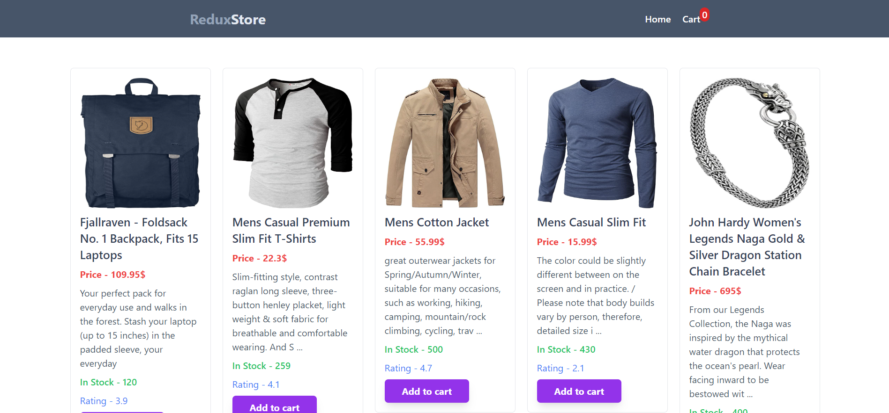
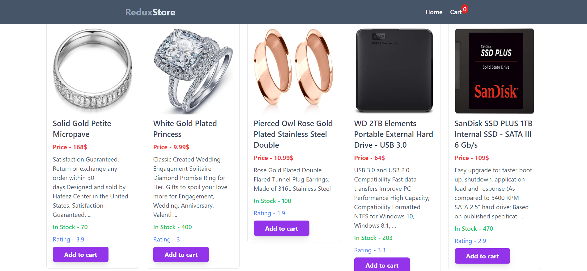
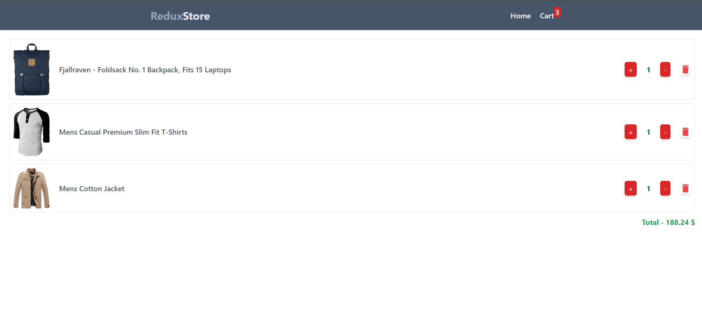

# E-Commerce Website 

## Table of Contents

1. [Introduction](#introduction)
2. [Features](#features)
3. [Technologies Used](#technologies-used)
4. [Live-Link](#Live-link)
5. [Stay-in-Touch](#Stay-in-Touch)

## Introduction

This project showcases the implementation of Redux Toolkit for efficient state management, particularly focusing on cart management in an e-commerce setting. It provides a solid foundation for building scalable and maintainable applications that require state management.

## Features

- Add products to the cart
- Remove products from the cart
- Increase/decrease product quantity in the cart
- Calculate total price of items in the cart

## Technologies Used

- React.js
- Redux toolkit 
- Vite 
- Fake store api

## Live-link

[Live-Link](https://redux-store-project.netlify.app/)

## Stay-in-Touch

## Connect with Me

Feel free to connect with me on professional platforms:

