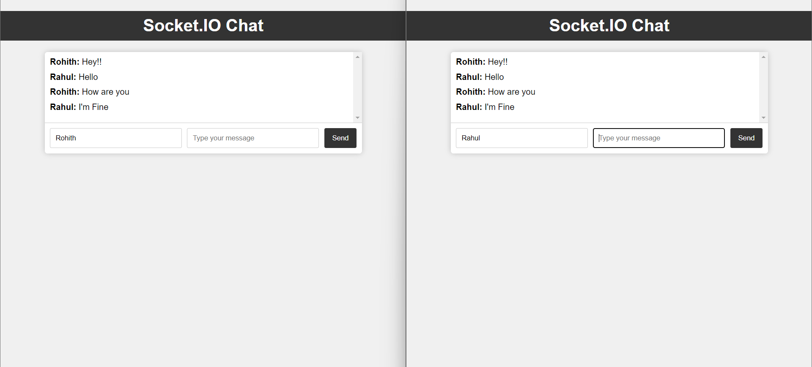

# Real-Time Chat Application with Socket.IO



## Table of Contents

- [Introduction](#introduction)
- [Features](#features)
- [Demo](#demo)
- [Installation](#installation)
- [Usage](#usage)
- [Technologies Used](#technologies-used)

## Introduction

This is a real-time chat application built using Socket.IO and Express.js. It allows users to join chat rooms, enter their names, and exchange messages in real-time with other users in the same room.

The application is designed for simplicity and ease of use, making it an ideal solution for both casual and professional chat scenarios.

## Features

- Real-time chat with multiple users.
- Users can enter their names before joining chat rooms.
- Multiple chat rooms support.
- Clean and intuitive user interface.

## Demo

You can try out the live demo of the chat application [here](https://chat-application-av5z.onrender.com/).

## Installation

To run the chat application locally, follow these steps:

```bash
# Clone the repository
git clone https://github.com/Rohith-Manjunath/Mini-projects2.git

# Navigate to the project directory
```bash
cd Socket io

# Install the required dependencies
npm install

## Usage

Start the application:

```bash
npm start

Open a web browser and go to http://localhost:2000.

Enter your name and start chatting in one of the available chat rooms.

Enjoy real-time chat with others!

## Technologies Used

-Socket.IO: For real-time communication between the server and clients.
-Express.js: As the web server framework.
-HTML/CSS: For the front-end user interface.
-JavaScript: For client-side scripting.
-Node.js: As the runtime environment.


